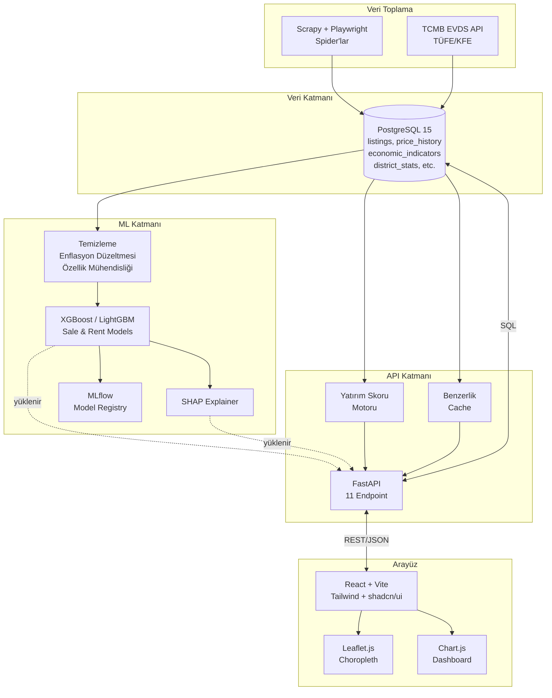
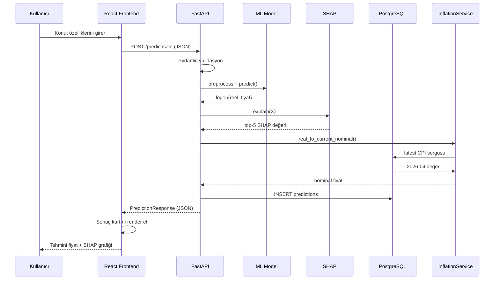
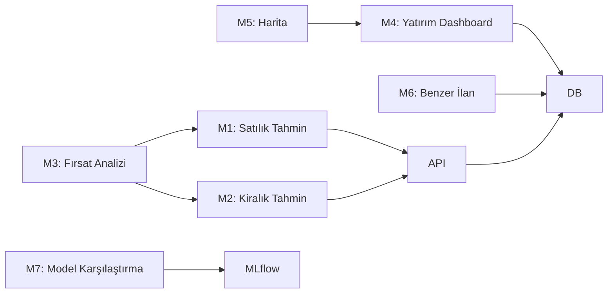

# Sistem Mimarisi

## Yüksek Seviye Akış

```mermaid
flowchart TB
    subgraph "Veri Toplama"
        SC[Scrapy + Playwright<br/>Spider'lar]
        EVDS[TCMB EVDS API<br/>TÜFE/KFE]
    end

    subgraph "Veri Katmanı"
        PG[(PostgreSQL 15<br/>listings, price_history<br/>economic_indicators<br/>district_stats, etc.)]
    end

    subgraph "ML Katmanı"
        ETL[Temizleme<br/>Enflasyon Düzeltmesi<br/>Özellik Mühendisliği]
        MODEL[XGBoost / LightGBM<br/>Sale & Rent Models]
        SHAP[SHAP Explainer]
        MLF[MLflow<br/>Model Registry]
    end

    subgraph "API Katmanı"
        API[FastAPI<br/>11 Endpoint]
        SCORE[Yatırım Skoru<br/>Motoru]
        REC[Benzerlik<br/>Cache]
    end

    subgraph "Arayüz"
        REACT[React + Vite<br/>Tailwind + shadcn/ui]
        LEAFLET[Leaflet.js<br/>Choropleth]
        CHART[Chart.js<br/>Dashboard]
    end

    SC --> PG
    EVDS --> PG
    PG --> ETL
    ETL --> MODEL
    MODEL --> SHAP
    MODEL --> MLF
    PG --> SCORE
    PG --> REC
    MODEL -.yüklenir.-> API
    SHAP -.yüklenir.-> API
    SCORE --> API
    REC --> API
    PG <-->|SQL| API
    API <-->|REST/JSON| REACT
    REACT --> LEAFLET
    REACT --> CHART
```

## İstek-Yanıt Döngüsü (Tahmin Örneği)

```mermaid
sequenceDiagram
    participant U as Kullanıcı
    participant F as React Frontend
    participant A as FastAPI
    participant M as ML Model
    participant S as SHAP
    participant DB as PostgreSQL
    participant I as InflationService

    U->>F: Konut özelliklerini girer
    F->>A: POST /predict/sale (JSON)
    A->>A: Pydantic validasyon
    A->>M: preprocess + predict()
    M-->>A: log1p(reel_fiyat)
    A->>S: explain(X)
    S-->>A: top-5 SHAP değeri
    A->>I: real_to_current_nominal()
    I->>DB: latest CPI sorgusu
    DB-->>I: 2026-04 değeri
    I-->>A: nominal fiyat
    A->>DB: INSERT predictions
    A-->>F: PredictionResponse (JSON)
    F->>F: Sonuç kartını render et
    F-->>U: Tahmini fiyat + SHAP grafiği
```

## Modül Bağımlılıkları

```mermaid
graph LR
    M1[M1: Satılık Tahmin] --> API
    M2[M2: Kiralık Tahmin] --> API
    M3[M3: Fırsat Analizi] --> M1
    M3 --> M2
    M4[M4: Yatırım Dashboard] --> DB
    M5[M5: Harita] --> M4
    M6[M6: Benzer İlan] --> DB
    M7[M7: Model Karşılaştırma] --> MLflow
    API --> DB
```
